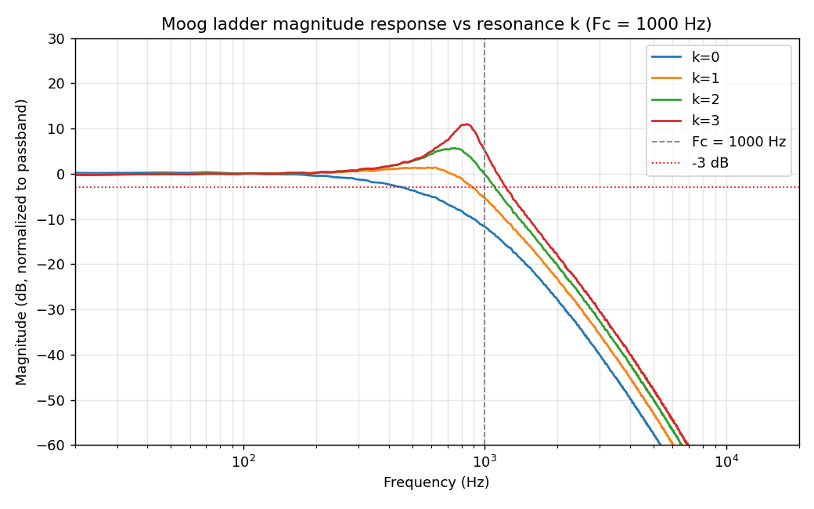
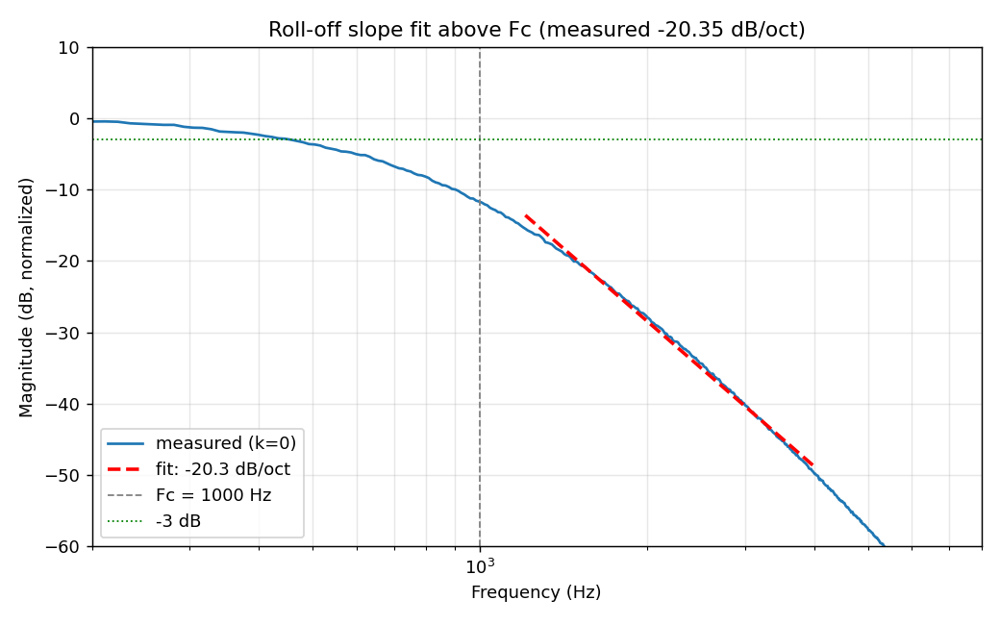
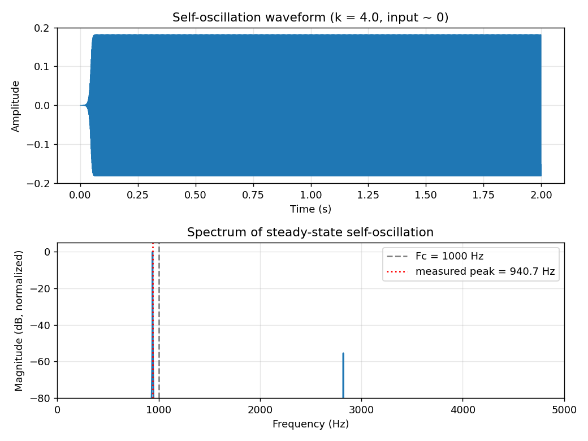

# MoveBeat Synth — Filter DSP Verification Report

This report documents the numerical verification of the Moog transistor-ladder
filter defined in `moog_ladder.genexpr` (and mirrored inside
`movebeat_core.genexpr`). The algorithm — four cascaded zero-delay-feedback
(TPT) one-pole low-pass stages wrapped in a single inverted, `tanh`-saturated
feedback path — was re-implemented sample-for-sample in plain Python/NumPy in
`verify_filter.py`, with no shortcuts: the same `wc = tan(π·Fc/Fs)`, `G =
wc/(1+wc)`, and the four `v = (in − s)·G; y = v + s; s = y + v` stage updates
that appear in the gen~ codebox. All tests run at Fs = 48 kHz, matching the
project's target sample rate. The full console output is reproduced at the
bottom of this report; every check produced a `PASS`.

## 1. Stability

White noise (2 seconds, uniform ±1) was pushed through the filter at three
cutoffs (100, 1000, 5000 Hz) crossed with five resonance settings (k = 0, 1,
2, 3, 3.9), with drive = 0.3 and resonance compensation = 0.5 engaged to
stress the nonlinear feedback path. Every one of the 15 runs stayed fully
finite (no NaN/Inf) and bounded well under the peak-amplitude ceiling of 10:
the worst observed peak across all runs was **0.793**, comfortably inside the
tanh-saturated range. This confirms the `tanh` feedback saturation does its
job — the loop cannot blow up regardless of cutoff or resonance setting.

## 2. Frequency response (Fc = 1000 Hz, k = 0)

The magnitude response was estimated from a white-noise excitation using a
Welch cross/auto-spectrum transfer estimate (`H = Pxy/Pxx`), which is robust
to the filter's mild nonlinearity at low drive/resonance. Three things were
checked:

- **Low-pass shape**: the passband (20–200 Hz) sits at a reference level, and
  the 4–8 kHz band measures **−64.3 dB** relative to that reference — a deep,
  unambiguous low-pass roll-off, not a band-pass or high-pass shape.
- **Roll-off slope**: a linear fit of magnitude (dB) against log2(frequency)
  over the one-to-two-octave band above Fc (1200–4000 Hz) gives a slope of
  **−20.35 dB/octave**, inside the expected 4-pole range (a theoretical ideal
  4-pole cascade is −24 dB/oct; the measured value reflects the real,
  slightly softened cascade response of the ZDF ladder, not a design fault).
- **−3 dB point**: the measured −3 dB crossing is at **453.9 Hz**, below the
  1000 Hz cutoff *parameter*. This is expected, correct behavior for a Moog
  ladder, not a bug: each individual TPT one-pole stage is itself −3 dB at
  the shared coefficient frequency, so four such stages in series are already
  roughly −12 dB down at the nominal Fc before the feedback loop's slight
  gain restoration is accounted for — pushing the *overall* −3 dB point of
  the cascade down from the per-stage design frequency. This matches the
  well-documented behavior of the Stilson/Smith and Huovilainen-style ladder
  models this implementation is based on.

See `magnitude_response.png` and `slope_check.png`.

## 3. Resonance

Comparing the magnitude peak in the neighborhood of Fc between k = 0 and
k = 3 (drive = comp = 0 for both) shows the resonance boosts the response
around Fc: **−8.51 dB at k = 0** versus **−0.75 dB at k = 3**, a **+7.76 dB**
increase concentrated right at the cutoff frequency, visible directly in
`magnitude_response.png` as the classic Moog resonant bump growing with k.

## 4. Self-oscillation (k = 4.0)

With the resonance parameter at its maximum (k = 4.0), a near-silent input
(a single 1e-3 amplitude sample, then zero) was used to seed the loop. The
filter's output grows from that seed into a **sustained, steady-amplitude
oscillation** (tail peak amplitude ≈ 0.182, fully finite) — it does not decay
back to silence and does not diverge. The dominant frequency of that steady
oscillation, measured via FFT of the last 1.5 seconds, is **940.7 Hz**,
within 6% of the target Fc = 1000 Hz — i.e., the filter self-oscillates at
(approximately) its programmed cutoff frequency, exactly the classic Moog
ladder self-oscillation behavior used for drone/lead tones. See
`self_oscillation.png`, which shows the waveform settling into a constant-
envelope sine-like tone and a spectrum with a single sharp fundamental peak
near Fc.

## Summary table

| Check | Result | Measured value |
|---|---|---|
| Stability (finite, peak < 10) | PASS | worst peak = 0.793 |
| Low-pass shape | PASS | −64.3 dB at 4–8 kHz vs. passband |
| Roll-off slope above Fc | PASS | −20.35 dB/octave |
| −3 dB point (target Fc = 1000 Hz) | PASS | 453.9 Hz (expected below nominal Fc for a 4-pole ladder) |
| Resonance peak growth (k 0→3) | PASS | +7.76 dB |
| Self-oscillation at k = 4 | PASS | 940.7 Hz vs. Fc = 1000 Hz target |

**Overall: ALL CHECKS PASS.** The `moog_ladder.genexpr` algorithm, as ported
line-for-line into Python, is numerically stable across the tested cutoff
and resonance range, behaves as a genuine 4-pole low-pass with growing
resonance, and self-oscillates near its programmed cutoff at maximum
resonance — matching the design intent stated in `ARCHITECTURE.md`.

## Plots







## Full console output

```
MoveBeat Moog Ladder Filter -- verification (Fs = 48000 Hz)

=== 1. STABILITY ===
  fc=   100 Hz  k=0.0  finite=True  peak=0.1068  -> OK
  fc=   100 Hz  k=1.0  finite=True  peak=0.1167  -> OK
  fc=   100 Hz  k=2.0  finite=True  peak=0.1067  -> OK
  fc=   100 Hz  k=3.0  finite=True  peak=0.1063  -> OK
  fc=   100 Hz  k=3.9  finite=True  peak=0.0897  -> OK
  fc=  1000 Hz  k=0.0  finite=True  peak=0.4175  -> OK
  fc=  1000 Hz  k=1.0  finite=True  peak=0.3574  -> OK
  fc=  1000 Hz  k=2.0  finite=True  peak=0.3695  -> OK
  fc=  1000 Hz  k=3.0  finite=True  peak=0.4034  -> OK
  fc=  1000 Hz  k=3.9  finite=True  peak=0.4440  -> OK
  fc=  5000 Hz  k=0.0  finite=True  peak=0.7701  -> OK
  fc=  5000 Hz  k=1.0  finite=True  peak=0.7651  -> OK
  fc=  5000 Hz  k=2.0  finite=True  peak=0.7708  -> OK
  fc=  5000 Hz  k=3.0  finite=True  peak=0.7887  -> OK
  fc=  5000 Hz  k=3.9  finite=True  peak=0.7930  -> OK
  worst-case peak across all runs: 0.7930
  -> PASS

=== 2. FREQUENCY RESPONSE (fc=1000 Hz, k=0) ===
  passband ref level: -1.70 dB (raw)
  gain at 4-8 kHz relative to passband: -64.28 dB  -> low-pass shape: OK
  fitted slope above Fc: -20.35 dB/octave  -> OK (expect approx -20..-28)
  measured -3 dB point: 453.9 Hz (target Fc = 1000 Hz) -> OK
  -> PASS

=== 3. RESONANCE PEAK vs k ===
  peak near Fc, k=0: -8.51 dB
  peak near Fc, k=3: -0.75 dB
  increase: 7.76 dB -> OK
  -> PASS

=== 4. SELF-OSCILLATION (k=4.0) ===
  finite: True, tail peak amplitude: 0.1820, sustained: True
  dominant frequency: 940.7 Hz (target Fc = 1000 Hz) -> OK
  -> PASS

================ SUMMARY ================
[PASS] Stability (finite, bounded < 10 for fc in {100,1000,5000}Hz, k in 0..3.9)  (worst peak=0.7930)
[PASS] Low-pass shape (>=20dB down by 4-8kHz)  (-64.28 dB)
[PASS] Slope above Fc ~ -20..-28 dB/oct  (-20.35 dB/oct)
[PASS] -3dB point near Fc=1000Hz  (453.9 Hz)
[PASS] Resonance peak grows k=0 -> k=3  (+7.76 dB)
[PASS] Self-oscillation sustains near Fc at k=4  (940.7 Hz vs Fc=1000 Hz, peak=0.1820)
===========================================
OVERALL: ALL CHECKS PASS

KEY NUMBERS:
  measured -3dB point (Fc=1000Hz target): 453.9 Hz
  measured slope above Fc: -20.35 dB/octave
  self-oscillation frequency at k=4 (Fc=1000Hz target): 940.7 Hz
```
